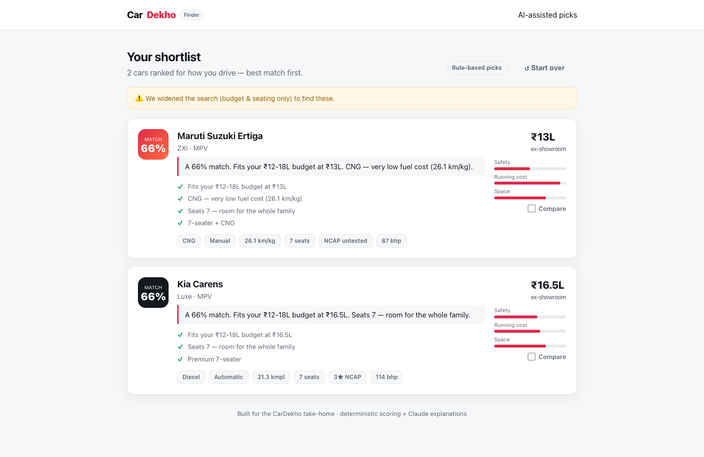

# CarDekho Car Finder

**From "I don't know what to buy" → "I'm confident about my shortlist" in 4 questions.**

A confused car buyer answers a short quiz (budget, usage, body style, fuel, priorities).
A backend scoring engine ranks every car in the dataset *for how that specific person drives*,
explains **why** each one made the shortlist, and lets them compare the top picks side-by-side.



---

## Run it in under 2 minutes

```bash
npm install
npm run dev
# open http://localhost:3000
```

That's it. **No API key, no database, no env file required** — the app is fully functional
out of the box.

> Optional: set `ANTHROPIC_API_KEY` (copy `.env.example` → `.env.local`) and the "why this
> car fits you" blurbs are written by Claude instead of the built-in templates. Everything
> else is identical. The UI shows an "✨ AI-written picks" badge when the key is active.

**Deploy:** push to GitHub → import on [Vercel](https://vercel.com/new) → deploy. Zero config
(it's a stock Next.js app). Add `ANTHROPIC_API_KEY` in Vercel env vars if you want the AI copy.

---

## What I built and why

The brief is about **decision-making under overload**, not browsing. A filter grid doesn't
help a confused buyer — they don't yet know what to filter for. So the highest-value thing is
a **guided recommender** that turns vague human priorities ("I want something safe and cheap to
run for the family") into a **ranked, explained shortlist**.

Three pillars:

1. **Guided quiz** — 4 short steps. Asks for *priorities and usage*, not just specs, because
   that's the input a confused buyer actually has.
2. **Scoring engine** (the non-trivial backend) — every car is scored 0–100 on five factors
   (safety, running cost, performance, space, value). The **weights shift based on the buyer's
   stated priorities and usage**, so the same car ranks differently for a city commuter vs. a
   highway family. Hard filters narrow to non-negotiables, and **gracefully relax** if nothing
   matches so the buyer never hits a dead end.
3. **Explanation + compare** — each pick gets a one-line "why this fits *you*" pitch plus the
   concrete reasons, and any 2–3 cars can be put side-by-side with the best value per spec
   highlighted.

### What I deliberately cut

- **No real database.** The dataset is a typed seed file (~32 real Indian cars). Persisting to
  Postgres adds setup friction with zero buyer value in a 2–3h window. The data layer is a
  single module, so swapping in a DB later is a one-file change.
- **No auth / saved accounts.** A buyer's session is self-contained; login is pure overhead here.
- **No live scraping / huge catalog.** 32 hand-picked cars across every segment and budget band
  exercise the engine fully. More rows wouldn't make the *product* smarter.
- **AI does explanation, not ranking.** Ranking is deterministic on purpose — it's reproducible,
  fast, debuggable, and testable. I used the LLM where it genuinely shines (turning structured
  scores into human language) and kept it out of the part that needs to be trustworthy.
- **Pixel-perfect polish, animations, image assets.** Clean and legible over flashy.

---

## Tech stack & why

| Layer | Choice | Why |
|---|---|---|
| Framework | **Next.js 14 (App Router)** | One repo, one command for frontend **and** backend (API routes). Fastest path to "it works and it's live" on Vercel. |
| Language | **TypeScript** (strict) | The whole value is in the data shapes — `Car`, `Preferences`, `ScoredCar`. Types make the scoring engine safe to refactor. |
| Backend | **Next.js Route Handler** | `POST /api/recommend` runs the scoring + explanation. Real server-side computation, no separate service to deploy. |
| AI | **Claude (Haiku) via REST**, optional | Batched single call writes all pitches; graceful template fallback so the app never depends on it. |
| Styling | **Hand-written CSS** (one file) | No Tailwind/UI-lib install or config. A small design-token system was faster here than wiring up a framework. |

No state library, no ORM, no component kit — the app is small enough that they'd be ceremony.

---

## AI tools: what I delegated vs. did myself

**Delegated to the AI (Claude Code):**
- Scaffolding all the boilerplate — `package.json`, `tsconfig`, layout, the CSS design system.
- The seed dataset (then I sanity-checked prices, NCAP ratings, and fuel/mileage for realism).
- First drafts of the React components from a clear spec of the flow and states.
- Driving a real browser to click through the whole quiz and screenshot every state.

**Did / drove myself (the judgment calls):**
- **Product scope** — deciding it's a *recommender*, not a filter; that AI explains but doesn't
  rank; what to cut. That framing is the actual work.
- **The scoring model** — factor design, normalization (EVs measured in km vs. petrol in kmpl
  can't share a scale, so running cost is modeled by fuel type), priority weighting, and the
  **graceful filter relaxation** so buyers never see an empty screen.
- **Review & course-correction** — caught and fixed a security advisory on the pinned Next.js
  version (bumped to a patched release), a broken CSS hex value, and verified the build +
  full UI flow rather than trusting it compiled.

**Where AI helped most:** turning a clear spec into working UI and boilerplate in minutes, and
end-to-end browser verification.
**Where it got in the way:** it happily pinned a Next.js version with a known CVE and would have
left a typo'd CSS color in — fine as long as you *review*, which is the whole point.

---

## Architecture

```
src/
  app/
    page.tsx              # flow orchestration: quiz → loading → results
    layout.tsx, globals.css
    api/recommend/route.ts# POST: validate prefs → score → explain → JSON
  components/
    Quiz.tsx              # 4-step wizard, client state + validation
    Results.tsx           # ranked list + compare selection
    CarCard.tsx           # one ranked car: score, pitch, reasons, match bars
    Compare.tsx           # side-by-side table, best-per-spec highlighting
  data/cars.ts            # seed dataset (the "platform dataset")
  lib/
    types.ts              # shared domain types
    scoring.ts            # the recommendation engine (pure, testable)
    explain.ts            # Claude pitch generation + template fallback
```

The engine in `lib/scoring.ts` is a **pure function** of `(cars, preferences)` — no I/O, no
framework — so it's trivial to unit-test or reuse.

---

## If I had another 4 hours

1. **Tests on the scoring engine** — it's pure, so a dozen `recommend()` cases (city commuter,
   family, performance) would lock in behavior. Highest-ROI thing I skipped.
2. **Conversational refinement** — a chat box on the results page ("show me cheaper", "more
   boot space") that nudges the weights and re-ranks live.
3. **"Why not these?"** — show the runners-up and one line on what edged them out, which builds
   even more buyer confidence.
4. **Real persistence + shareable shortlist URL** — save a shortlist to a DB and share a link.
5. **Richer data** — ownership/service cost, real images, EMI calculator on each card.

---

## Scripts

```bash
npm run dev        # local dev server
npm run build      # production build
npm run typecheck  # tsc --noEmit (strict)
npm run lint       # next lint
```
